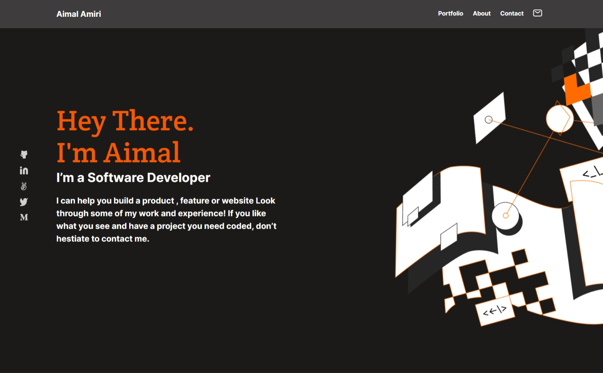
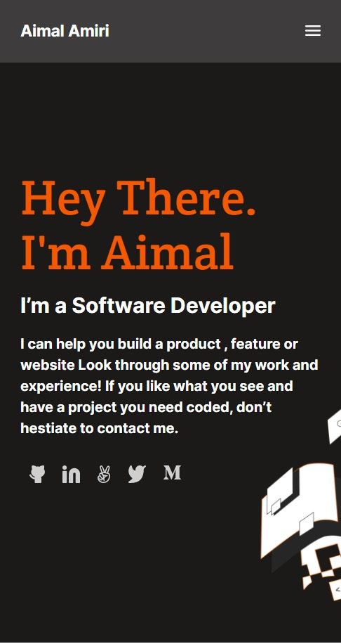

# My Microverse Portfolio

> This is my my portofolio website.

This project is following the W3C [Accessibility Principles](https://www.w3.org/WAI/fundamentals/accessibility-intro/), so it is accessible for everyone ✔

### Screen Shots

1. The desktop version

2. The mobile version

## Built With

- HTML 5
- CSS 3

## Live Demo 

You can check the live demo [here](https://aimalamiri.github.io/Microverse-Portfolio/).

## Getting Started

**Just clone the project by runing the `git clone git@github.com:aimalamiri/Microverse-Portfolio.git` command in your command line, and you are done.**

## Authors

👤 **Aimal Amiri**

- GitHub: [@githubhandle](https://github.com/aimalamiri)
- Twitter: [@twitterhandle](https://twitter.com/Aimalamiri)
- LinkedIn: [LinkedIn](https://linkedin.com/in/aimal-amiri)

## 🤝 Contributing

Contributions, issues, and feature requests are welcome!

Feel free to check the [issues page](../../issues/).

## Show your support

Give a ⭐️ if you like this project!

## Acknowledgments

- Hat tip to anyone whose code was used
- Inspiration
- etc

## 📝 License

This project is [MIT](./MIT.md) licensed.
